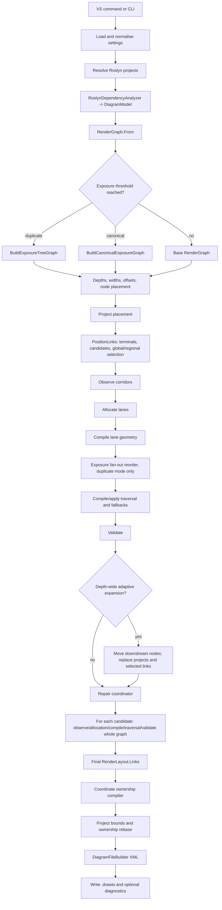
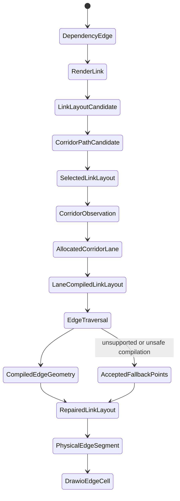
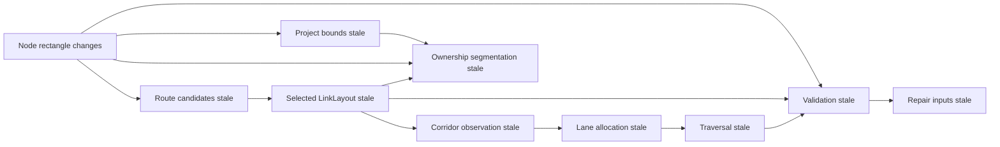
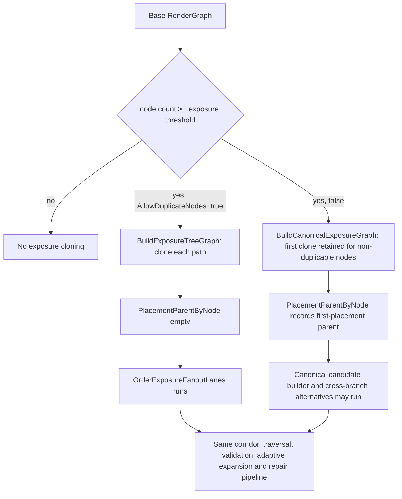
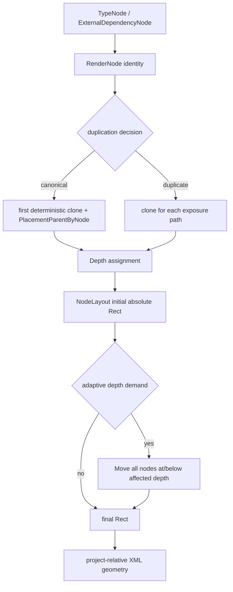
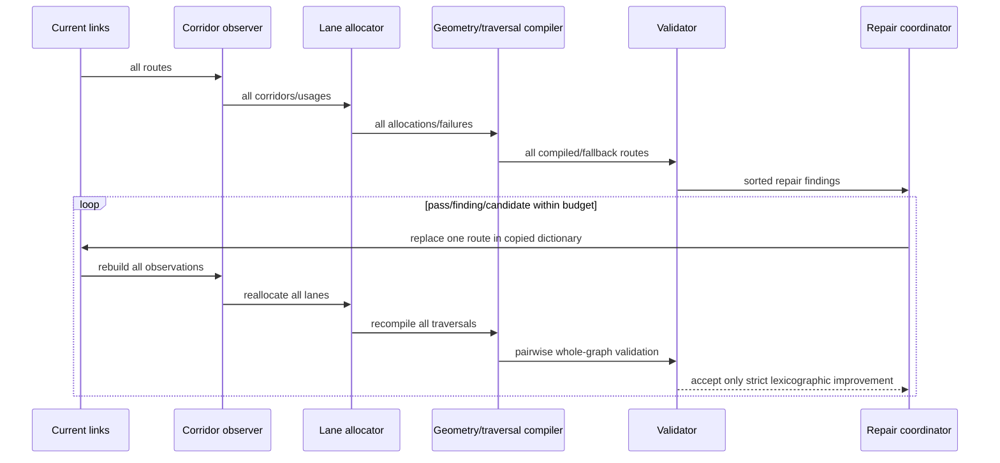
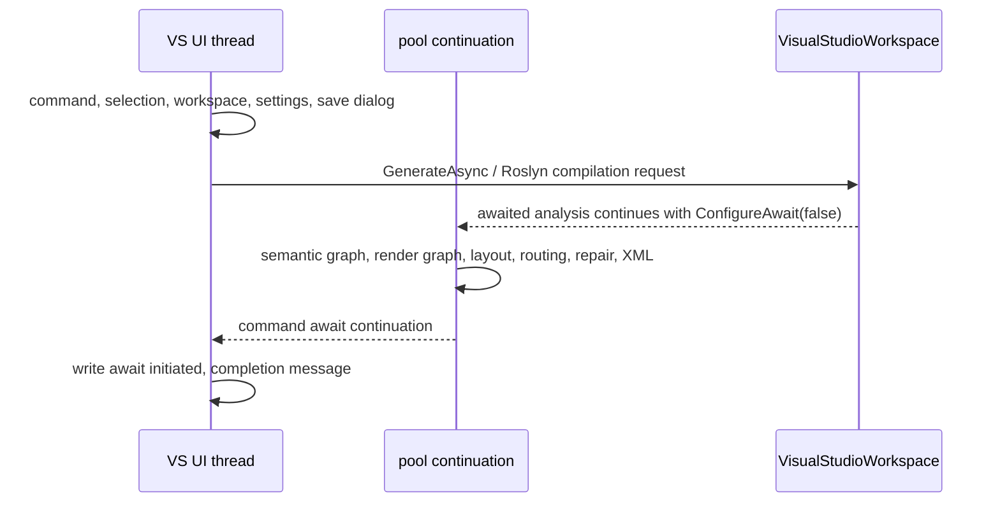

# Current generation pipeline audit

Audit baseline: branch `feature/decuplicate-node-option`, version 0.3.9, 17 July 2026. This document describes the implementation as it exists. It does not prescribe a replacement architecture and the audit made no routing or layout changes.

> Historical status: this audit intentionally remains a record of the `0.3.9` baseline. The subsequent pipeline-consolidation tranche introduced authoritative route revisions, pre-validation normalization, revision-aware corridor mappings, structured capacity requests, regional repair closures, diagnostic-result reuse, pipeline telemetry, duplicated-mode conditional repair bypass, and Visual Studio background execution. The current design is documented in [Routing architecture](routing-architecture.md); statements below about missing instrumentation, post-observation fan-out mutation, whole-graph trial validation, or the absence of an explicit route authority model describe the audited baseline only.

## Executive findings

1. `LinkLayout` is repeatedly replaced. There is no single route object whose identity survives candidate selection, lane compilation, traversal fallback, adaptive expansion and repair. The final `RenderLayout.Links` is authoritative for serialization, while `PathSelection`, `Corridors`, `Lanes` and `Traversals` can describe earlier or partially reconstructed geometry.
2. The initial corridor/lane/traversal pipeline is discarded when adaptive layer expansion moves nodes. `PositionLinks` is rerun, then the repair coordinator performs another complete observation/allocation/traversal/validation pass.
3. Each repair candidate recompiles and validates every route, not an affected region. Traceability validation is pairwise. This is the clearest implementation-level explanation for the duplicated-mode cost.
4. Corridor identity is derived from spatial grouping of current collinear segments. It does not carry source/target region, obstacle history, terminal role or candidate-family identity. Long cross-branch routes and short local routes can therefore become members of the same spatial corridor.
5. Failed corridor allocation does not expand the corridor in the same pass. The lane compiler leaves the original coordinate for an unallocated mapping; traversal compilation then records fallback diagnostics and commonly retains accepted geometry.
6. Adaptive capacity is depth-wide and occurs after the first corridor observation. It moves every node at or below an affected depth, reruns route selection, and can create a materially different corridor system.
7. Clean perpendicular crossings are informational, but shared geometry, spacing and bend findings feed a bounded repair loop. A lower-priority local improvement cannot be accepted if the whole-graph lexicographic score worsens at a higher tier.
8. The VS command acquires selection/workspace/settings/save path on the UI thread. Roslyn analysis uses `ConfigureAwait(false)` and rendering follows it on a pool continuation in the normal asynchronous case; file completion and the message return to the UI context. Workspace compilation can still contend with Visual Studio, and the command exposes no progress or cancellation UI.

## High-level runtime flow



### Stage contract table

| Stage | Input -> output | Mutation/replacement | Moves nodes | Changes route points | Scope/repetition | Authority/invalidation |
|---|---|---|---:|---:|---|---|
| Settings | JSON/defaults -> `DiagramSettings` | new object | no | no | once | authoritative configuration |
| Roslyn analysis | projects -> `DiagramModel` | new semantic model | no | no | projects/documents, compilations requested three times | authoritative semantic graph |
| Render graph | `DiagramModel` -> `RenderGraph` | new render nodes/links | no | no | once | authoritative render identity |
| Exposure graph | base graph -> cloned/canonical graph | replacement | no | no | once above threshold | invalidates base render IDs for layout |
| Layering | graph -> depth/width/offset dictionaries | new derived maps | no | no | whole graph once | input to placement only |
| Placement | maps -> `NodeLayout` | new rectangles | yes | no | whole graph once | authoritative until expansion |
| Projects | nodes -> `ProjectLayout` | new rectangles | containers only | no | initial, after expansion, after ownership bounds | becomes stale whenever owned geometry moves |
| Link positioning | graph/nodes -> `LinkLayout` plus selection results | new routes | no | yes | whole graph; initial and after expansion | selected logical geometry at that moment |
| Corridor observation | nodes/links -> `CorridorObservation` | new derived model | no | no | initial and every repair compile | stale after any node or route change |
| Lane allocation | observation -> `CorridorLaneAllocation` | new derived model | no | no | initial and every repair compile | stale after observation changes |
| Lane geometry | links/observation/allocation -> new `LinkLayout` | replaces route points | no | yes | all links | authority passes to compiled link geometry |
| Fan-out reorder | compiled links -> new links | replaces first horizontal lanes | no | yes | duplicate exposure-tree mode only | makes prior lane model partially stale |
| Traversal | links/corridors/lanes -> traversal and compiled links | new model then replaces links | no | yes or fallback | all links | fallback can restore accepted/logical points |
| Validation | nodes/final links -> violations | new derived model | no | no | initial and every repair candidate | stale after any geometry mutation |
| Adaptive expansion | nodes/findings -> moved nodes | replaces rectangles | yes | indirectly | depth-wide, once | invalidates links/corridors/lanes/traversals/validation |
| Repair | selected links -> best compiled links | replacement per accepted trial | no | yes | bounded passes; every trial is whole graph | final `Links`, corridors, lanes, traversals and validation are mutually rebuilt |
| Ownership | logical links/projects -> anchors/physical segments | new serialization model | no | coordinate conversion/splitting only | once, then rebase | must exactly reconstruct final logical links |
| XML | layout/ownership -> text | new document | no | simplification during emission | once per export; diagnostics invokes export again | emitted XML is final artefact |

## Route-state transition and representations



| Representation | Owner/type | Coordinates/terminals | Validation and mutability | Replacement/staleness |
|---|---|---|---|---|
| Semantic edge | `DependencyEdge`, analyzer | identities only | immutable record; no geometry | replaced by render edge mapping |
| Render edge | `RenderLink`, `RenderGraph` | identities only | immutable record | cloned IDs differ by duplication mode |
| Logical route | `LinkLayout` + immutable `RoutedEdgeGeometry` | absolute canvas; source/target held separately | obstacle checked during candidate construction; spacing not final | replaced at every compilation stage |
| Candidate | `CorridorPathCandidate` | absolute; `Points` include complete candidate | can carry invalid flag, fan-out membership and local cost | reduced then selected; alternatives are not retained in final diagnostics for most routes |
| Selected set | `CorridorPathSelectionResult.Selected` | absolute complete points | global score; deterministic selection | can become stale after lane compilation and is stale after adaptive expansion reruns positioning unless replaced result is retained |
| Corridor mapping | `CorridorSegmentMapping` | absolute segment plus route segment index | observation only | stale after any point change |
| Lane | `AllocatedCorridorLane` | absolute X or Y coordinate | capacity checked, not obstacle checked independently | failed corridors have no allocation |
| Lane geometry | new `LinkLayout` from `CorridorLaneGeometryCompiler` | absolute; terminals protected by region rules | obstacle validation happens later | can be overwritten by traversal fallback |
| Traversal | `EdgeTraversal` | terminal access, corridor and junction records | compilation checks orthogonality, round-trip and node collision | `AcceptedFallbackPoints` may restore earlier geometry |
| Compiled traversal | `CompiledEdgeGeometry` | complete absolute points | says whether fallback used | applied into another `LinkLayout` |
| Repair trial/final | `RouteRepairResult.Links` | absolute | each trial fully recompiled and validated | best whole-graph score replaces current state |
| Physical segment | `PhysicalEdgeSegment` | absolute plus parent-relative waypoints | reconstruction tested; no new routing | one logical dependency becomes multiple XML edges |
| XML edge | `mxCell`/`mxGeometry` | parent-relative or root absolute | Draw.io-authoritative explicit geometry | final persisted representation |

The source of truth progresses as follows: selected `LinkLayout` -> lane-compiled `LinkLayout` -> traversal-applied `LinkLayout` -> repair result `LinkLayout` -> ownership segments -> XML. Earlier selection/corridor objects are diagnostics, not safe alternative authorities after downstream replacement.

## Actual invalidation graph



Current recomputation:

* Initial node placement correctly precedes the complete first route pipeline.
* Adaptive expansion moves nodes, recomputes projects and calls `PositionLinks`; it does not independently expose the second selection's corridor state. The repair coordinator immediately reconstructs corridors, lanes, traversals and validation from those links.
* Every repair candidate rebuilds every downstream route structure and validates the whole graph, even though only one route was replaced.
* Exposure fan-out ordering changes route points after lane allocation and before traversal compilation without re-observing corridors. Traversal mappings therefore describe the pre-reorder geometry.
* Ownership/project-bound recompilation occurs after final routing. Project-bound changes are handled by `Rebase`, so absolute route geometry is preserved.
* Serialization consumes `RenderLayout.Links`, the same representation final validation inspected. It can normalize redundant points, so non-enforced immediate reversals may disappear only at emission.

## Duplication-mode flows



### Enabled (`AllowDuplicateNodes=true`)

The exposure tree recursively clones nodes per path and multiplies render links. It bypasses canonical first-placement and cross-parent canonical ownership, but it does **not** bypass corridor observation, all-route lane allocation, traversal compilation, pairwise validation, adaptive spacing or repair. It additionally runs `OrderExposureFanoutLanes` because `PlacementParentByNode` is empty. On the audited cCoder input it emitted 1,095 vertices and 1,072 logical edges and took 46.447 seconds.

### Disabled (`AllowDuplicateNodes=false`)

The canonical exposure graph retains the first deterministic clone of a non-duplicable node, records its placement parent, and routes later parents to that existing render node. Canonical-specific candidate construction and regional selection are available. The audited graph had 294 routes in the diagnostic result and took 11.963 seconds in default generation.

The enabled slowdown is therefore explained first by graph expansion (1,072 versus 294 routes) combined with pairwise validation and per-repair whole-graph recompilation. It is not evidence that canonical candidate generation is running in enabled mode.

## Representative route traces

The current diagnostic API records selected candidate points, final route points, traversal fallback status, repair before/after points and violations. It does not snapshot every candidate-reduction, observed-corridor and lane-compiled waypoint set. Consequently the table marks non-observable boundaries rather than inventing point sequences.

| Case | Selected/final evidence | First observed problem | Later behavior |
|---|---|---|---|
| Upper long horizontal bundle | `ScriptController -> ScriptOrchestrationService`: `(23370,130) -> (23370,140) -> (8692,140) -> (8692,316) ...`; candidate `VHVHV:MMMMMMMM` | final validation reports a 13,267 px shared interval with another upper route | no direct shared repair candidate was accepted; route remains fallback-marked |
| Dense external vertical route | representative external route candidate `VHVHV:MMLMLMMM`, beginning `(11740,130) -> (11740,140) -> (11700,140) -> (11700,260) ...` | corridor/lane state is not serialized in diagnostic report; final geometry remains densely aligned with external access band | terminal access is protected, then ownership splits the route at project/root boundaries |
| Reversal/tail | post-repair validation contains 15 `ImmediateReversal` observations; examples occur at `(28862,340)`, `(28790,240)`, `(28426,200)` and `(28046,160)` | traversal or fallback preserves a short out-and-back point sequence; validator detects it after repair | immediate reversal is non-enforced because XML ownership/serialization normalization can remove terminal-access redundancy |
| Clean local route | short parent-to-child routes with no final finding preserve selected and final normalized points | none | lane/traversal compilation either round-trips or retains accepted fallback points |

No evidence shows one universal introduction stage for all shared geometry. Candidate routes can already share a highway; lane compilation separates successfully allocated corridors; failed allocation preserves explicit geometry; fan-out reorder can then change a first lane without re-observation. The missing per-stage snapshot is itself an audit finding and should be resolved before another route correction.

## Highway bundle

The final deduplicated diagnostic contains 294 routes. For the upper `Y=140` band, 14 distinct routes have horizontal segments longer than 1,000 px, spanning approximately X=3,692 through X=27,416. At least one route pair shares 13,267 px. Across the diagram, the longest observed horizontal segments are 27,142 px and 27,091 px at Y=700, and 26,986 px at Y=480.

Corridors are spatial groups of collinear segments. Capacity is `floor(perpendicular extent / lane spacing)` as constructed by the observer; required lanes are the number of distinct sorted edge IDs using the group. If required lanes exceed capacity, the allocator records the corridor ID in `FailedCorridorIds` and creates no lanes for it. The geometry compiler then retains original coordinates for those mappings. Traversal compilation records unsupported traversal/fallback diagnostics and can retain the accepted route.

Observed bundle summary:

```text
routes in upper Y=140 band (>1000px): 14
distinct Y coordinates within that exact band: 1
minimum separation in that band: 0px
configured required separation: 12px (default for unspecified setting)
largest reported shared interval: 13,267px
unallocated/fallback routes: present; per-corridor counts are not exported
corridor capacity/required capacity: held internally, absent from JSON report
```

Adaptive expansion occurs after the first corridor observation/validation. On cCoder it expanded eight depth boundaries by 40 px each. It then reran node/project/link positioning; repair re-observed the entire graph. Corridors are spatial, not grouped by source/target region. Terminal accesses are excluded from some lane shifts, but their adjacent horizontal bands can coincide with long cross-branch highways.

## Terminal comb

Terminal X offsets are allocated by grouping routes by source and target, deterministic same-side sorting, and `PortOffset`. Terminal lane spacing is `max(LinkPadding*2, ParallelLaneSpacing*2)`. Source points remain on the bottom edge and target points on the top edge. `BuildRoute` creates terminal stubs; corridor compilation deliberately avoids shifting mappings whose orientation merges directly with the first or last terminal segment. This protects terminal order but concentrates many stubs into a narrow band.

The comb is therefore a combination of intended distinct terminal ports and insufficient transition distance into a wider successfully allocated corridor. It is not duplicated terminal points alone. Exact incoming count, target width and actual spacing are node-specific and are not currently emitted in the report. With the audited settings, node width is 200 px, configured horizontal spacing 20 px, vertical spacing 40 px; effective terminal lane spacing uses the resolved default `LinkPadding` and `ParallelLaneSpacing` because those fields are omitted from the imported settings.

## Reversal and simplification ownership

Simplification exists in these places:

1. Candidate construction and `SelectBestRoute` remove redundant route points while protecting source exit and target entry.
2. `EdgeTraversalCompiler.Normalize` collapses duplicate and collinear triples for round-trip comparison only; it does not necessarily replace the emitted route.
3. Traversal compile appends distinct points and may restore `AcceptedFallbackPoints` on unsupported, non-orthogonal, round-trip-mismatch or node-collision cases.
4. Local repair candidate construction normalizes its new bypass/offset route before full compilation.
5. Coordinate ownership splitting preserves absolute geometry and suppresses zero-length segments.
6. `DiagramFileBuilder` performs final XML-oriented redundant-point/reversal handling.

Later stages can reintroduce a reversal by shifting adjacent corridor coordinates, allocating a junction transition, or restoring accepted fallback points. The screenshot-tail class is visible after repair validation (15 raw observations), so it is introduced or retained before ownership serialization; the current report cannot distinguish lane compilation from traversal fallback for each tail without a stage snapshot.

## Node state and movement authority



| Node case | Identity/duplication | Placement and later movement | Ownership |
|---|---|---|---|
| Canonical shared node | one render clone for a non-duplicable semantic type; first sorted traversal creates it | first placement parent is recorded; assigned depth/rectangle once; adaptive expansion may translate it by cumulative depth deltas; repair does not move it | semantic project container |
| External diamond | unique per relationship when duplication is enabled; per owning project/semantic external grouping otherwise | positioned as render node; adaptive depth translation applies | project-owned when created for that project's relationship; relative XML geometry |
| Ordinary single-parent | one render node/clone | depth, initial rectangle, possible adaptive translation | project-owned |
| Prior-overlap node | same model as above; obstacle in validation | repair routes around it but does not alter its rectangle | unchanged ownership |

Concrete audited identities are `ICoreAuthInfo` and `AuthorizationBroker` as the highest observed canonical fan-in targets (three incoming rendered routes each), an `ICoreContextFactory` external diamond reached by `ContentBroker`, and ordinary single-parent coordination/processing nodes. The earlier overlap class is represented by the `CultureBroker -> ICoreContextFactory` topology: the external render identity is created during render-graph construction, its project owner is carried into `RenderNode.ProjectId`, its absolute rectangle is produced by `PositionNodes`, adaptive expansion may translate that rectangle with its depth, and ownership compilation finally writes project-relative geometry. The diagnostic JSON does not currently retain the initial and post-expansion rectangles separately; only the final XML rectangle and route-stage repair points survive. That prevents a truthful numeric rectangle-by-rectangle trace from an already-generated file and is an explicit instrumentation gap.

Only initial placement and adaptive layer expansion move nodes in the audited runtime. Project-bound compilation changes container rectangles, not node absolute rectangles.

## Repair-loop sequence



Default budgets are 32 affected routes, four candidates per finding, two passes and 128 estimated work. Graphs above 256 links use 16/2/1/24. cCoder used all 24 units: eight adaptive layer changes, eight node attempts (six accepted), and eight shared attempts (none accepted).

## Performance and complexity

The current code has no stage timer or invocation counter. The audit deliberately did not add production-visible instrumentation, so exact millisecond attribution inside `RenderLayout.Build` is unavailable. The following timings are repeatable wall-clock CLI measurements from the same Release build, same project and same settings, differing only in `AllowDuplicateNodes`:

| Mode | Routes/edges | Wall time | Final enforced advisories |
|---|---:|---:|---|
| disabled/canonical | 294 diagnostic routes | 11.963 s | node 0, shared 48, spacing 10, reused 9 |
| enabled/duplicated | 1,072 logical edges, 1,095 vertices | 46.447 s | shared 5 |

Major complexity:

| Work | Approximate complexity | Repetition |
|---|---|---|
| Roslyn analysis | projects + syntax nodes; compilations requested in three passes | once per CLI invocation |
| Exposure cloning | O(render paths), potentially exponential in branching/depth until cycle guard | once |
| SCC/depth/layout | O(V+E), plus sorting | initial and after route-demand movement only for affected derived structures |
| Candidate generation/reduction | O(E*C*obstacles), bounded candidates per edge | initial, and again after adaptive expansion |
| Global selection | bounded estimated work up to 2,000,000 | once per `PositionLinks` |
| Regional optimization | interaction discovery includes route pairs; bounded region work | once per `PositionLinks` |
| Corridor observation | segment grouping and spatial comparisons | initial plus every repair trial |
| Lane allocation | O(corridors + usages log usages) | initial plus every repair trial |
| Traversal/junction allocation | routes/segments plus junction matching | initial plus every repair trial |
| Validation | node-route plus route-pair comparisons, approximately O(E*V + E²*S²) | initial plus every repair trial |
| Repair | up to budget trials times full observation/allocation/traversal/validation | 24 trials on large cCoder |
| Ownership/serialization | O(points + physical segments) | once for generation; diagnostic export repeats the full preparation |

Whole-graph recomputation points are the second `PositionLinks` after adaptive expansion, the initial `RouteRepairCoordinator.Compile`, every repair candidate trial, and a separate complete `Prepare` when CLI diagnostics call `ExportDiagnostic` after `GenerateResult`. Strict/diagnostic CLI mode therefore renders twice.

## Visual Studio thread sequence



UI-bound work: command registration/invocation, DTE/hierarchy selection, obtaining `VisualStudioWorkspace`, settings UI/store access, save dialog and message box. Roslyn analysis explicitly uses `ConfigureAwait(false)` internally; orchestration does the same before synchronous rendering. The longest continuous CPU operation is rendering/repair on the pool in the ordinary asynchronous path, but Visual Studio compilation/workspace activity may still contend with IDE services. There is no progress, cancellation wiring from the command, or explicit `Task.Run` boundary guaranteeing that synchronous completion cannot begin on the UI thread. Safe future off-thread work includes graph construction, all layout/routing/validation/repair, ownership compilation, serialization and file text generation. DTE, hierarchy, dialogs and VS service acquisition must remain UI-bound.

## Intended versus actual

| Area | Intended | Current implementation | Mismatch | Likely consequence |
|---|---|---|---|---|
| Canonical first placement | stable first placement | deterministic first clone and placement parent | largely aligned; later depth translation allowed | cross-parent routes can be long but target stays stable |
| Parent/child alignment | local hierarchy readable | depth/subtree layout plus corridor reservations | shared canonical parents break tree locality | long cross-branch highways |
| Route authority | one authoritative logical route | successive `LinkLayout` replacements plus fallback points | competing historical geometry | hard-to-trace regressions |
| Terminal compatibility | monotonic ordered exits/entries | protected port sorting and terminal-region checks | narrow transition band not jointly capacity-planned | comb-like fan-in/out |
| Corridor partitioning | semantic/spatial corridors | spatial collinear grouping only | no obstacle/region/terminal-role identity | unrelated traffic shares highways |
| Adaptive capacity | expand affected local corridor | depth-wide expansion after first validation | global vertical movement, no X-local region | larger diagram and changed routes |
| Lane spacing | configured separation | successful corridors allocate it; failures retain explicit points | failure preserves overlap | zero/near-zero separation |
| Shared handling | deterministic separation | bounded per-route offsets, strict whole-graph score | candidates often rejected because other conflicts change | long shared intervals survive |
| Fallback | preserve safe authoritative route | several traversal fallbacks restore accepted/logical points | restored route may not match later corridor model | stale diagnostics/model disagreement |
| Repair locality | affected region only | one route changes, entire graph recompiles | not regional computationally | duplicated-mode latency |
| Validation | feedback and advisory | feedback plus whole-graph acceptance score | raw and enforced notions differ; pairwise cost repeated | difficult score interpretation and high cost |
| Duplicate bypass | skip canonical-only work and retain stable fast output | skips canonical graph but runs complete corridor/repair system and fan-out reorder | expanded graph receives expensive generic work | 46.4 s generation and IDE unresponsiveness |
| UI responsiveness | cancelable background work with progress | async analysis/background continuation but no progress/cancel guarantee | user sees one long command | perceived freeze |

## Competing mechanisms

| Mechanisms | Conceptual owner | Why both exist / contradiction risk |
|---|---|---|
| Candidate fallback vs traversal fallback | candidate selection should own feasible logical geometry; traversal should only prove compilation | traversal can restore a route after lanes were allocated for another geometry |
| Lane geometry compiler vs exposure fan-out reorder | terminal/corridor allocator should jointly own lane coordinates | fan-out moves the first horizontal lane after observation/allocation, making mappings stale |
| Adaptive layer spacing vs route repair offsets | layout owns physical capacity; repair owns local choice | depth-wide movement changes all candidates before local repair begins |
| Global selector vs regional optimizer | one bounded selection coordinator | both score alternatives at different scopes, increasing state transitions |
| Validator normalization vs serializer cleanup | final logical normalization should precede validation | immediate reversals may be reported on geometry serializer later changes |
| Project placement vs ownership bounds compiler | ownership/bounds compiler owns final visual containment | two project rectangles are expected, but diagnostics before final bounds can describe earlier boxes |
| `GenerateResult` vs `ExportDiagnostic` preparation | one generation result should feed both artefact and diagnostics | CLI diagnostics performs the whole generation pipeline twice |

## Likely root-cause areas, without proposed fixes

1. Loss of a single authoritative route-state lineage across selection, lane geometry, traversal fallback and repair.
2. Post-allocation fan-out mutation without corridor re-observation.
3. Depth-wide adaptive expansion followed by complete route reselection.
4. Spatial-only corridor identity and capacity failure falling back to coincident explicit geometry.
5. Whole-graph validation/recompilation for each local repair trial.
6. Diagnostic export repeating complete preparation.
7. Duplicate exposure-tree growth feeding pairwise validation and generic repair.
8. Missing stage snapshots/counters prevents attributing a specific screenshot defect without further audit instrumentation.

## Design decisions required before implementation

* Which representation is the sole authoritative logical route, and may downstream compilation ever replace it rather than return a rejected compilation?
* Should terminal access be a separately capacity-planned corridor class?
* What spatial and semantic fields define corridor identity?
* Does capacity failure request layout space, preserve explicit geometry, or reject that route candidate?
* Is adaptive expansion local by region, by corridor, or intentionally depth-wide?
* Which computations can be incrementally invalidated after changing one route?
* Should duplicated mode bypass repair when the accepted duplicated baseline has no node collisions?
* Should diagnostics consume the already-created `DrawioGenerationResult` instead of generating again?
* Where must final normalization happen so validation and serialization inspect identical points?
* What cancellation/progress contract should the VS command expose?

## Audit verification

The audit used the Release CLI against `cCoder.ContentManagement.csproj` with `artifacts/node-duplication/real-project-deduplicated-settings.json`, toggling only `AllowDuplicateNodes` and restoring it afterward. Outputs are under `artifacts/pipeline-audit/`. Existing unit tests and a full build are the completion gates. No routing, placement, scoring, allocation, validation policy, CLI behavior, threading, version or VSIX file was changed.
