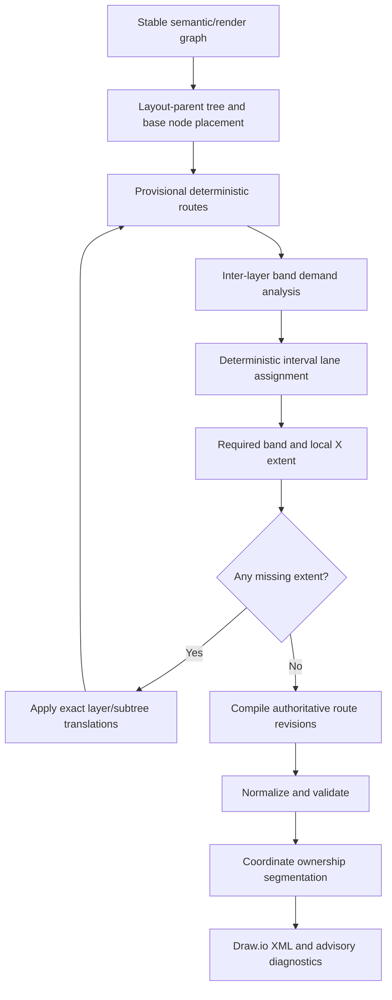

# Simplified layer-band layout and routing plan

Status: design proposal only. This document does not authorize implementation, routing changes, refactoring, version changes, or VSIX packaging.

## 1. Decision summary

The authoritative-route work should be retained as the stable foundation. `LogicalRouteState`, immutable history, explicit revisions, final normalization, validation diagnostics, ownership segmentation, deterministic serialization, and generation telemetry solve lifecycle and observability problems independently of the current corridor-capacity strategy.

The replacement should make space a calculated output of routing demand:



The primary convergence rule is:

```text
all vertical band expansion deltas == 0
and all local horizontal separation deltas == 0
```

An iteration guard detects non-convergence. It is not a visual capacity limit. The failure diagnostic must name the repeatedly changing bands/subtrees and retain the last parseable authoritative geometry.

## 2. Current mechanisms and disposition

| Mechanism | Retain | Replace | Delete | Transitional only | Rationale/replacement owner |
| --- | ---: | ---: | ---: | ---: | --- |
| Semantic and render graph | Yes |  |  |  | Stable input, duplication policy and deterministic render identities. |
| Canonical and duplicated node construction | Yes |  |  |  | Preserves modes, exceptions and canonical first placement. |
| `LogicalRouteState` and revisions | Yes |  |  |  | Becomes authority shared by provisional, band-compiled, normalized and validated geometry. |
| Deterministic depth/layer assignment | Yes |  |  |  | Feeds the layout-parent tree and bands. Strongly connected components remain bounded layers. |
| Existing hierarchical placement |  | Yes |  | Yes | Separate tree construction, base placement and translation composition. |
| Terminal port ordering | Yes |  |  |  | Supplies ordered source/target transition demand before lane assignment. |
| Global coordinate-descent selection |  |  | Yes | Yes | Retained behind a compatibility switch until supported band fixtures pass. |
| Regional optimisation |  |  | Yes | Yes | Replaced by direct band/subtree measurement, not another optimiser. |
| Corridor observation |  | Yes |  | Yes | Replaced by explicit band crossings and X-local vertical-lane observations. |
| Spatial corridor identity |  | Yes |  | Yes | Band ID, overlap group and interval become the relevant identities. |
| Lane allocation |  | Yes |  | Yes | Replaced with deterministic interval-graph lane colouring without fixed capacity. |
| Lane geometry compilation |  | Yes |  | Yes | Replaced with band route compilation using assigned coordinates. |
| Traversal compilation |  | Yes |  | Yes | Reduced to route-shape compilation plus explicit unsupported-shape diagnostics. |
| Junction allocation |  | Yes |  | Yes | Simple turns become part of band transitions; retain only proven complex topology support until covered. |
| Terminal transitions | Yes |  |  |  | Adapt fields from corridor ownership to band demand and assigned lanes. |
| Capacity requests |  |  | Yes | Yes | Replaced by `RequiredRoutingExtent`; no allocation-failure semantics. |
| Bounded capacity expansion |  |  | Yes | Yes | Replaced by exact missing-delta expansion and convergence. |
| Repair coordinator |  |  | Yes | Yes | Validation feeds measurement/detours during layout; no post-selection geometry authority. |
| Whole-graph lexicographic scoring |  |  | Yes | Yes | Keep only comparison tooling during migration; normal routing uses deterministic local rules. |
| Validation | Yes | Yes |  |  | Retain findings; reorganize as measurement feedback plus final advisories and spatial indexing. |
| Final normalization | Yes |  |  |  | Remains the single pre-validation cleanup stage. |
| Ownership segmentation | Yes |  |  |  | Unchanged Draw.io ownership contract. |
| Project ownership bounds | Yes |  |  |  | Recalculate from final absolute owned geometry as today. |
| Diagnostic telemetry/result reuse | Yes | Yes |  |  | Add band iterations, demand, translations and convergence reasons. |
| Visual Studio background/cancellation | Yes |  |  |  | Preserve the command boundary; add cancellation checkpoints between iterations. |
| Legacy `DrawioExporter` |  |  | Yes | Yes | It is registered but not used by `DrawioDiagramRenderer`; remove after compatibility/API review. |

Deletion is intentionally delayed until each replacement owns the accepted behavior and the corresponding fixture gate is green.

## 3. Proposed data model

```csharp
LayoutHierarchy
{
    LayoutParentByNode: IReadOnlyDictionary<NodeId, NodeId>
    LayoutChildrenByNode: IReadOnlyDictionary<NodeId, IReadOnlyList<NodeId>>
    RootNodeIds: IReadOnlyList<NodeId>
    Revision: int
}

NodeBasePlacement
{
    NodeId
    Layer
    BaseRect
    StableOrder
}

LayoutTranslations
{
    LayerYOffsetByBoundary
    SubtreeXOffsetByRoot
    Revision
}

InterLayerRoutingBand
{
    BandId
    UpperLayer
    LowerLayer
    CrossingRoutes
    SourceTransitions
    TargetTransitions
    ThroughSegments
    HorizontalOverlapGroups
    LaneSpacing
    TopClearance
    BottomClearance
    TurnAllowance
    Padding
    RequiredHeight
    CurrentHeight
    ExpansionDelta
    Revision
}

BandRouteDemand
{
    LogicalEdgeId
    RouteRevision
    BandId
    XInterval
    Role // source-transition, target-transition, through, return
    PreferredOrder
    AssignedLane
}

RequiredRoutingExtent
{
    ScopeId // band or local X region
    Axis
    CurrentExtent
    RequiredExtent
    MissingExtent
    Contributors
    LayoutRevision
}
```

Every derived object carries its layout/route revision. Stale band demand or lane assignments fail in development and tests instead of being reused.

## 4. Layout-parent hierarchy

The layout hierarchy is internal metadata only:

```text
single-parent node        -> dependency parent
canonical multi-parent   -> deterministic first-placement parent
duplicated exposure node -> cloned path parent
root                     -> no layout parent
```

The deterministic first-placement parent is selected by the existing stable semantic ordering. Other semantic parents remain ordinary incoming dependencies and never acquire subtree ownership.

Cycles are condensed using the existing strongly connected component depth calculation. Within a component, one deterministic representative may be attached to the external layout parent while the component's remaining nodes use a deterministic local order. The layout hierarchy itself must remain acyclic.

### Coordinate representation recommendation

Use stable absolute base rectangles plus composed translation tables:

```text
final Y = base Y + cumulative layer-boundary offsets
final X = base X + cumulative applicable subtree offsets
```

This is preferable to repeatedly rewriting rectangles because it avoids numeric drift and makes each movement attributable. It is simpler than internal parent-relative coordinates because canonical nodes have one layout parent but several semantic parents, and nested relative transforms would complicate obstacle queries. Materialize a read-only absolute `NodeLayout` snapshot once per iteration for routing and serialization.

| Model | Strength | Weakness | Decision |
| --- | --- | --- | --- |
| Rewrite absolute rectangles | Simple consumers | Repeated mutation, drift, unclear causality | Do not adopt as primary model. |
| Stable bases plus layer/subtree offsets | Deterministic, auditable, cheap vertical shifts | Needs one materialization step | Recommended. |
| Internal parent-relative coordinates | Natural subtree motion | Complex canonical/cycle transforms and obstacle queries | Not recommended. |

### Stage A implementation boundary

Stage A resolves this design as `HierarchyAnalyzer -> LayoutHierarchy -> PlacementPipeline -> PlacedGraph`. `LayoutHierarchy` carries SCC membership, acyclic parent/child relationships, stable ordering, visual layers, edge direction, provenance, and the layout revision. `PlacementPipeline` contains coherent ordinary and exposure placement sections and returns stable base rectangles plus composed translations. `ProjectPlacementResult` separately records initial project rectangles and visual ownership.

The initial placed graph is revision 0. Legacy capacity expansion creates a revised immutable placement and recomputes translations from the same bases. `LegacyRoutingPipeline` consumes this typed boundary and remains the sole routing authority through Stage A. The detailed contract is documented in [layout-placement-architecture.md](layout-placement-architecture.md).

## 5. Draw.io ownership decision

Physical Draw.io parentage does not follow the layout-parent tree.

```text
project-owned node/anchor/edge portion -> project container
root-owned node/edge portion           -> Draw.io root
```

Dependency nodes never become Draw.io children of dependency nodes. Existing project movement, project-relative geometry, external-diamond ownership, cross-project segmentation, logical metadata and manual-editing behavior remain unchanged.

## 6. Inter-layer bands

Create one band for every adjacent visual-layer boundary. A route from layer 1 to layer 4 contributes to bands `1->2`, `2->3` and `3->4`. An upward route contributes to each boundary in reverse direction and receives the `return` role.

For a band, required height is derived from actual occupied regions rather than a universal sum:

```text
top reserve
max height of mutually conflicting horizontal lane groups
turn/junction reserve required by those groups
bottom reserve
outer padding
```

Top and bottom transition reservations are interval-aware. Two terminal transition groups may share vertical space when their X envelopes do not overlap and their turns cannot collide. The band height is the maximum compatible stack, not the sum of every route's clearance.

Contributors are:

- protected source stubs entering the band;
- source fan-out turns and ordered transition lanes;
- overlapping horizontal route intervals;
- vertical-through crossings, which constrain placement but do not automatically consume another horizontal lane;
- target convergence turns and protected target stubs;
- configured route padding and parallel-lane spacing;
- a return-lane region when upward routes cannot safely share the downward region.

Current height is measured between the inflated lower edge of the upper layer and inflated upper edge of the lower layer. Node inflation uses link padding; project-container decoration is not a routing obstacle within its own project.

### Example

```text
upper nodes        [A]              [B]
                     |  |           |
top reserve          |  +----+      |
lane 0             ======== | =======
lane 1                =========
turn allowance                |  |
bottom reserve                 |  |
lower nodes                  [C] [D]

required: 148 px
current:   76 px
delta:     72 px (applied once)
```

## 7. Deterministic lane assignment

Horizontal lane assignment is interval-graph colouring with deterministic preferences:

1. Extract each provisional horizontal segment's normalized `[minX, maxX]`, logical edge ID, role and terminal order.
2. Partition by band and by compatible role region (`downward`, `return`, and protected terminal subregions where required).
3. Sort by interval start, interval end, terminal order, then logical edge ID.
4. Maintain active intervals ordered by end coordinate.
5. Release lanes whose previous interval ends before the new interval begins with required longitudinal clearance.
6. Reuse the lowest compatible lane; otherwise create the next lane.
7. Preserve monotonic terminal order by using it as a lane constraint within the terminal overlap group.
8. Convert lane indices to Y coordinates only after exact band expansion.

For interval graphs, greedy colouring in start order uses the maximum simultaneous overlap count when ties are deterministic. Non-overlapping X intervals reuse lanes. A perpendicular vertical segment records a crossing but does not conflict unless it coincides with a turn, terminal stub or node clearance envelope.

The assigned lane stack is:

```text
laneCount == 0 ? 0 : laneThickness + (laneCount - 1) * configuredLaneSpacing
```

Lane thickness may remain the connector stroke/clearance abstraction rather than literal pixels. The plan must test stroke widths greater than one before fixing this calculation in production.

## 8. Exact vertical expansion and convergence

For every iteration:

1. Build all band demands from the same layout and route revisions.
2. Assign lanes and calculate every band's required height.
3. Compute `delta = max(0, required - current)`.
4. Apply all deltas in upper-to-lower boundary order to the layer-offset table.
5. Re-materialize node rectangles once.
6. Regenerate only routes crossing changed bands plus routes incident to moved nodes.
7. Repeat because new detours or horizontal translations may change other demand.

Known deltas are applied completely; there are no fixed-size or two-pass increments.

Expansion is monotonic within a generation: offsets never shrink. This gives a simple convergence argument for ordinary downward graphs because a stable finite set of lanes eventually has sufficient extent. If a demand grows on every iteration, diagnostics report the changing route set, required heights and revisions. A configurable development guard (initial proposal: 16 iterations) detects defects but does not serialize an apparently successful capacity fallback.

## 9. X-local vertical-lane spacing

Horizontal expansion is narrower and evidence-driven:

1. Extract vertical segments and group those with overlapping Y intervals and insufficient X separation.
2. Exclude clean perpendicular crossings and segments already distinguished by terminal transitions.
3. Assign deterministic X lanes within each local conflict region.
4. Identify the nearest layout-parent sibling boundary capable of creating the missing extent.
5. Shift the smaller movable sibling/subtree suffix; never move the canonical shared node away from first placement merely to shorten a later-parent route.
6. Minimize added width, number of moved nodes, and distance from the conflict, in that order.

Candidate movement scopes are adjacent sibling subtree, ordered suffix of siblings, then the containing project-local root group. Movement of unrelated projects or distant roots requires an explicit diagnostic and is not a default fallback.

This mechanism should be introduced only after a deterministic failing fixture demonstrates vertical-lane collision. It is not a global two-dimensional optimiser.

## 10. Simplified route shapes

### Downward adjacent-layer route

```text
source bottom -> protected stub -> assigned band Y
-> horizontal band lane -> target transition X
-> protected target stub -> target top
```

Direct vertical routes omit redundant horizontal points when obstacle-safe and uniquely traceable.

### Skipped-layer route

```text
source transition -> source-band horizontal correction
-> stable vertical through-lane across intermediate bands
-> target-band horizontal correction -> target transition -> target top
```

The route participates in every crossed band. Its vertical through-lane uses one deterministic X coordinate for as long as obstacle clearance permits, reducing bends and identity changes.

### Canonical cross-branch route

Preserve the canonical target's first-placement position. Generate direct, left-exterior and right-exterior obstacle-safe variants. Select deterministically by validity, terminal compatibility, added local extent, bend count, length and signature. This is a small local choice, not whole-graph coordinate descent.

### Upward route

```text
source transition -> nearest safe return side
-> assigned return X lane outside relevant node/band envelope
-> above target -> target transition -> target top
```

Return lanes are separated from ordinary downward transition space where their intervals conflict.

## 11. Validation as measurement and advisory

| Finding | Layout-time interpretation | Final behavior |
| --- | --- | --- |
| Parallel overlap | Add routes to one overlap group and allocate distinct lanes. | Advisory only if it remains after supported assignment. |
| Spacing deficit | Compute missing band or X-local extent. | Report actual/required spacing if unresolved. |
| Node intersection | Generate direct/left/right obstacle-safe detour; if geometry lacks room, request local extent. | Never suppress; retain best parseable route and identify obstacle. |
| Immediate reversal | Normalization/compiler defect. | Focused test failure; production advisory if encountered. |
| Reused bend | Measure whether continuation is genuinely ambiguous. | Otherwise informational advisory. |
| Perpendicular crossing | No expansion by default. | Informational unless it coincides with a turn/terminal ambiguity. |

The final validator consumes normalized authoritative geometry exactly as serialization does. During migration, old and new pipelines should produce the same typed findings so comparison tooling remains useful.

Repeated O(E²) validation should be replaced in stages with band-local interval sweeps, node spatial indexing, and route-pair caches keyed by route revision. One final whole-diagram validation remains acceptable as a generation checkpoint, not as a refusal gate.

## 12. Migration stages and rollback points

### Grouped constraint-sweep replacement for Stage C

Stage C no longer means vertical expansion followed by the complete legacy corridor and route-by-route repair stack. Its authority is a monotonic constraint sweep over stable identities and immutable placement/route snapshots:

```text
stable base placement
-> node-spacing constraints
-> provisional supported routes
-> grouped route-spacing analysis
-> merge minimum X/Y/width constraints with max()
-> materialize one revised placement
-> invalidate the affected route closure
-> regenerate each affected group atomically
-> repeat until no minimum increases and no route remains invalidated
-> normalize and validate
```

The constraint store contains stable IDs rather than mutable geometry references. Its minimum types are layer-boundary Y, sibling/subtree-boundary X, and project/root-group width. A materialized coordinate is the stable base position plus cumulative layer, subtree and project offsets. Stored minimums never decrease within a generation.

Spacing work is flattened and ordered by Y, X, scope type, then stable band/subtree/project identity. Movement remains hierarchical: a layer boundary moves every lower layer; an adjacent sibling constraint moves the coherent sibling subtree or ordered sibling suffix; project enlargement moves later complete project groups while preserving their stable order. A conflict in one project cannot directly rearrange individual nodes inside another project. Canonical nodes retain first-placement relationships.

Before provisional routing, a node-spacing sweep produces hierarchy-owned constraints for node overlap, sibling clearance, layer clearance, project containment and external dependency clearance. Route demand may add further constraints and cause another materialization pass.

Within each band, horizontal intervals form an inclusive conflict graph. Disjoint intervals do not conflict; endpoint contact and positive-length overlap are classified separately. Connected components are atomic spacing groups, so transitive A-B-C conflicts receive one lane assignment, one extent calculation and one constraint proposal. Vertical segments use the equivalent grouped Y-interval analysis for X-local constraints.

A shared endpoint is classified using both routes' incoming/outgoing directions, terminal roles and supported-junction identity. Distinct bends, ambiguous merges/departures and indistinguishable continuations require separate turns or lanes. A perpendicular intersection is a clean crossover only when it lies strictly inside one horizontal and one vertical straight segment, neither route bends or terminates there, no merge/junction semantics apply, and no collinear overlap exists. Clean crossovers are accepted without expansion and may carry only a low-priority route cost. An accepted crossover is never a bend.

Each spacing group reports its stable group ID, orientation, routes, segments, current/required lanes and extent, movement scope, moved nodes and invalidated routes. Group lane assignments and regenerated routes are committed together or not at all. Predictable group findings do not enter the legacy route-by-route repair coordinator.

The invalidation closure contains routes incident to moved endpoints, crossing an expanded band, participating in or sharing lanes with the group, newly intersecting moved obstacle envelopes, and upward routes crossing an altered boundary. Invalidated dependencies retain semantic identity but discard their current point sequence. They are regenerated against the new placement revision; old waypoints are never translated wholesale. Unrelated routes retain their authoritative revisions and geometry.

Vertical required extent includes upper-node clearance, source stub and transition, the complete horizontal lane stack, target transition and stub, lower-node clearance, return-route space where it conflicts, padding and configured spacing. The full missing delta is merged once and moves only the lower layer and layers beneath it. There is no maximum band height, lane count, canvas extent or graph-size refusal.

Horizontal constraints prefer the adjacent sibling subtree, ordered sibling suffix, containing project root, then neighbouring complete project groups. Internal project expansion recomputes project bounds; later projects move only enough to restore configured clearance. Cross-project routes affected by container movement are regenerated.

Convergence occurs when no X, Y or width minimum increases and no affected route requires regeneration. Iteration guards diagnose non-convergence rather than accepting overlap. Diagnostics list changing groups, revisions, previous/new extents, affected routes and movement scopes.

Pure proposal analysis may run in parallel over immutable independent bands/projects. Workers return constraints, lane assignments, candidates and observations. Mutation and acceptance remain sequential. Proposals merge deterministically by stable group ID and minimums merge with `max()`. Any shared route, obstacle or movement scope joins the proposals into one dependency group. Sequential and parallel proposal analysis must produce byte-identical output.

`SeparateOverlappingCorners` is not an owning production transformation. Supported route generation assigns distinct lane and turn coordinates. An overlapping generated corner is an invariant failure that regenerates the complete group. The preserved experimental branch remains research for unsupported residual shapes; production may retain only an assertion after supported migration.

The first supported slice is deliberately narrow: ordinary downward routes contained in one adjacent-layer band, with bottom-source/top-target terminals and orthogonal transitions. All routes in an interacting group must share one authority. If any group member is unsupported, the complete generation uses the legacy pipeline. Later slices add skipped layers, return routes, canonical cross-branch groups, X-local vertical spacing and cross-project groups.

Stage C telemetry records groups observed, pairwise findings collapsed, proposals, increased constraints, moved scopes/nodes/layers, invalidated and regenerated routes, parallel groups, merged dependency groups, convergence iterations, comparisons, and elapsed observation/merge/materialization/regeneration/validation time.

| Stage | Change | Acceptance fixtures | Rollback point |
| --- | --- | --- | --- |
| A | **Complete:** `HierarchyAnalyzer`, `LayoutHierarchy`, stable base placements, composed translations, typed project placement, and immutable `PlacedGraph`; legacy routing remains authoritative. | Single chain, two siblings, canonical multi-parent, duplicated exposure path, SCC/cycle, reversed enumeration, ownership, revision and cancellation. | Revert the Stage A extraction commits and restore placement inside `RenderLayout`. |
| B | Add observational `InterLayerRoutingBand` telemetry without changing geometry. | Adjacent, skipped-layer, upward, fan-out, non-overlapping interval reuse, crossing. | Stop emitting band telemetry; no output change. |
| C | Group ordinary adjacent-layer downward routes, merge monotonic node/band constraints, apply exact vertical extent, allocate live lanes and regenerate affected groups atomically to convergence. | Inclusive endpoint classification, transitive groups, exact expansion, lower-only movement, invalidation closure, atomic commit, determinism. | Select the complete legacy pipeline at generation entry for any unsupported interacting group. |
| D | Extend grouped authority to skipped-layer and canonical cross-branch routes. | Long canonical incoming route, first-placement preservation, multi-band membership and exterior alternatives. | Select the old pipeline for the complete generation; never mix authority inside a group. |
| E | Add skipped-layer, canonical cross-branch and upward/return routes. | Long incoming canonical route, first-placement preservation, multi-band participation, exterior obstacle detour. | If the graph contains an unsupported route shape, select the old pipeline for the complete generation; never mix route authorities. |
| F | Add demonstrated X-local vertical-lane separation and subtree offsets. | Two overlapping vertical highways, unaffected sibling, minimal-width movement, canonical node fixed. | Disable X expansion while retaining vertical bands. |
| G | Make band pipeline default for explicitly supported graphs; compare typed geometry/diagnostics. | Full compact catalogue plus StandardIo and cCoder four modes. | One generation-level switch selects old pipeline. |
| H | Remove old capacity, global/regional selection and repair code after parity gates and review. | No tests depend on old types; full real-project and determinism gates. | Last commit before deletion; no runtime dual pipeline afterward. |

Never select old geometry after a new pipeline route revision has been partially compiled. During migration, selection occurs once at graph/generation entry: entire old pipeline or entire new pipeline for a supported graph.

## 13. Fixture gates

Required compact fixtures:

1. One adjacent-layer vertical dependency.
2. Two and three same-source downward fan-outs with monotonic terminal order.
3. Overlapping horizontal intervals requiring two/three lanes.
4. Non-overlapping intervals reusing one lane.
5. Perpendicular crossing without extra expansion.
6. Route skipping two or more layers and appearing in every crossed band.
7. Upward route using a return region.
8. Canonical target with short and long parents while preserving first placement.
9. Duplicated exposure tree and deduplicated canonical equivalent.
10. Regex duplication exception.
11. Exact band expansion delta and one-iteration stabilization.
12. Multiple band deltas composed without coordinate drift.
13. Endpoint contact between two straight continuations.
14. Endpoint contact where one route bends.
15. Two routes sharing one bend.
16. Clean perpendicular crossover strictly inside both straight segments.
17. Perpendicular intersection where one route bends and is not a crossover.
18. Transitive overlap group A-B-C.
19. Existing minimum constraint never reduced.
20. Sibling subtree/right suffix movement preserving earlier siblings.
21. Project enlargement moving a later complete project.
22. Moved endpoint and unmoved band-crossing route invalidation.
23. Atomic group route commit.
24. Deterministic merge of conflicting proposals.
25. Sequential/parallel proposal parity.
26. Supported generation requiring no corner post-processing.
13. X-local vertical-lane conflict shifting only the chosen sibling subtree.
14. Obstacle detour requesting extent rather than crossing a node.
15. Ownership reconstruction and project-container movement unchanged.
16. Reversed node/edge enumeration producing byte-identical XML.
17. Non-convergence diagnostic containing revisions and repeated demands.

## 14. Real-project gates

Generate with identical recorded settings and rebuilt Release CLI:

```text
StandardIo: duplication enabled and disabled
cCoder:     duplication enabled and disabled
```

For each, preserve output, diagnostics, stage timings and SHA-256 repeat hash. Report nodes, routes, project bounds, band count, maximum lanes per band, total exact Y/X expansion, iterations, node intersections, shared segments, spacing deficits, reversals and advisories.

Acceptance:

- StandardIo remains under 5 seconds including Roslyn analysis and has no node overlap.
- cCoder duplicated and deduplicated target under 15 seconds without skipping required work.
- no fixed visual size/lane/capacity refusal;
- no shared collinear geometry caused by allocation failure;
- terminal order, first placement, ownership and deterministic output remain intact;
- deduplicated output remains canonical, not artificially tree-shaped.

## 15. Expected complexity

Let V be render nodes, E routes, B crossed band memberships, and K local conflicts.

```text
render graph and layout hierarchy: O(V + E)
depth/SCC assignment:              O(V + E)
base subtree placement:            O(V + E)
band membership extraction:        O(B)
interval sorting/colouring:         O(B log B)
X-local interval grouping:          O(E log E + K)
route compilation:                  O(total emitted segments)
indexed validation:                 O((V + E) log(V + E) + reported conflicts)
```

Ordinary routes cross a small number of bands, while worst-case B can be O(EV) for routes spanning every layer. The implementation should store band memberships explicitly and invalidate only routes crossing changed bands. It must avoid repeated whole-graph recompilation per route.

Performance design targets:

```text
StandardIo total:       < 5 seconds
cCoder duplicated:      < 15 seconds
cCoder deduplicated:    < 15 seconds
```

## 16. Files expected to change during migration

Likely additions:

- `Models/Drawios/LayoutHierarchyModels.cs`
- `Models/Drawios/InterLayerRoutingBandModels.cs`
- `Services/Processings/Drawios/LayoutHierarchyBuilder.cs`
- `Services/Processings/Drawios/LayerBandObserver.cs`
- `Services/Processings/Drawios/IntervalLaneAssigner.cs`
- `Services/Processings/Drawios/LayerBandExtentPlanner.cs`
- `Services/Processings/Drawios/LayerBandRouteCompiler.cs`
- `Services/Processings/Drawios/LocalHorizontalExtentPlanner.cs`

Existing files initially adapted:

- `DeterministicDrawioExporter.RenderGraph.cs`
- `DeterministicDrawioExporter.RenderLayout.cs`
- `DeterministicDrawioExporter.Models.cs`
- `LogicalRouteNormalizer.cs`
- `TraceabilityValidator.cs`
- `CoordinateOwnershipCompiler.cs`
- `ProjectOwnershipBoundsCompiler.cs`
- `DeterministicDrawioExporter.cs`
- `DrawioDiagnosticReportBuilder.cs`
- `DiagramFileBuilder.cs`
- relevant focused tests and real-project scripts/artifacts

Files deleted or greatly reduced only in Stage H:

- `CorridorObserver.cs`
- `CorridorLaneAllocator.cs`
- `CorridorLaneGeometryCompiler.cs`
- `GlobalCorridorPathSelector.cs`
- `RegionalCorridorPathOptimizer.cs`
- `RouteRepairCoordinator.cs`
- most of `EdgeTraversalCompiler.cs`
- most or all of `SimpleJunctionAllocator.cs`
- superseded corridor/path-selection/repair model files and tests
- legacy `DrawioExporter.cs` after public-registration compatibility review

## 17. Risks and open design questions

1. Whether stroke width contributes directly to lane-stack extent or through a resolved clearance value.
2. Exact compatibility rules allowing source/target transition reserves to share Y space.
3. How SCC-internal upward/lateral routes select return regions without making cycle layout excessively wide.
4. Whether one stable through-lane X can always serve a skipped-layer route or must split at obstacle boundaries.
5. The smallest safe subtree scope for X-local movement when the conflicting route connects different projects.
6. Whether a canonical node's first-placement subtree may move as a whole during sibling spacing while preserving the meaning of first placement. Proposed answer: yes, relative placement is preserved; later parents do not re-centre it.
7. How much route-pair validation remains necessary after band-local interval proofs.
8. Whether the public/DI-registered legacy `IDrawioExporter` is a compatibility contract or dead API.
9. How cancellation should checkpoint inside a synchronous band iteration without introducing nondeterministic parallel mutation.
10. Which existing complex junction fixtures genuinely require retained junction logic after band compilation.

## Appendix A. Maintainability inventory for the next review

Counts are from the planning baseline on `feature/decuplicate-node-option`. Private-method counts are syntactic inventory counts, not complexity scores.

| Source file | Lines | Types | Private methods | Major responsibilities | Direct dependencies | Test coverage / likely extraction |
| --- | ---: | --- | ---: | --- | --- | --- |
| `.../Processings/Drawios/DeterministicDrawioExporter.RenderLayout.cs` | **2,244** | `RenderLayout`, `LayerExpansionResult`, `PositionedLinkLayouts` | 58 | Depth/SCC, placement, exposure trees, centring, overlap/corridor reservation, candidate generation, global/regional selection, fan-out, route shapes, expansion, pipeline orchestration | Almost every Draw.io routing component and settings/model dictionaries | Broad deterministic exporter, layered regression, duplication, capacity and selector tests. Extract hierarchy, placement, band planning, route construction and orchestration. |
| `.../Foundations/Drawios/DrawioExporter.cs` | **1,595** | `DrawioExporter` plus private geometry/layout records | 46 | Legacy independent layout, routing, styling and XML | Diagram models/settings, LINQ to XML | 936-line `DrawioExporterTests`. Candidate for deletion, not refactoring, after API review. |
| `.../Orchestrations/Diagrams/DeterministicDrawioExporter.DiagramFileBuilder.cs` | **1,445** | `DiagramFileBuilder`, nested generators and data-model route records | 80 | Architecture XML plus unrelated data-model table layout/routing | XML, settings, ownership, layout, style resolver | Deterministic exporter/ownership tests. Extract architecture serializer and data-model diagram renderer. |
| `.../Processings/Drawios/DeterministicDrawioExporter.RenderGraph.cs` | 459 | `RenderGraph`, nested `NodeDuplicationPolicy` | 11 | Base render graph, external-node ownership, canonical/duplicated exposure graphs | Diagram model, duplication regex/settings | `RenderGraphDuplicationTests`, node-duplication exporter tests. Extract policy and layout-hierarchy construction. |
| `.../Models/Drawios/DeterministicDrawioExporter.Models.cs` | 398 | Render/layout/route states and geometry records | 2 | Unrelated graph, layout, authoritative route and geometry types | Core diagram models | Route-state and routed-geometry tests. Split graph, route lifecycle, layout and primitives. |
| `.../Processings/Drawios/CorridorObserver.cs` | 430 | `CorridorObserver`, observed/group records | 19 | Segment extraction, spatial grouping, identity, capacity, transitions | Corridor/terminal/route models | Corridor observer/model and canonical pipeline tests. Replaced by band observer. |
| `.../Processings/Drawios/RouteRepairCoordinator.cs` | 434 | budgets/results/coordinator/pipeline/score | 19 | Candidate repair, regional closure, repeated compile/validate, scoring | Observer, allocator, traversal, normalizer, validator | Repair tests. Transitional deletion after measurement pipeline. |
| `.../Processings/Drawios/CoordinateOwnershipCompiler.cs` | 371 | compiler and ownership run | 15 | Boundary splitting, anchors, project-relative segments, reconstruction | Node/project/link geometry | Ownership compiler/serialization/authority fixtures. Retain; extract intersection/splitting helpers if reviewed. |
| `.../Processings/Drawios/DrawioDiagnosticReportBuilder.cs` | 375 | diagnostic builder | 14 | JSON report, focused Draw.io overlays, scoring/category projection | Layout, ownership, XML, JSON | Diagnostic builder/exporter tests. Separate report projection from annotated XML. |
| `.../Processings/Drawios/TraceabilityValidator.cs` | 328 | violations/result/validator | 11 | Pairwise route findings and node collisions | Route/node geometry | Dedicated validator tests. Retain API; replace internals with spatial/band indexes. |
| `.../Processings/Drawios/EdgeTraversalCompiler.cs` | 274 | traversal compiler | 10 | Corridor/junction traversal reconstruction and rejection | Corridor lanes, junction allocator, route state | 397-line traversal tests. Reduce/delete after band compiler owns route shapes. |
| `.../Processings/Drawios/RegionalCorridorPathOptimizer.cs` | 257 | regional optimizer | 5 | Interaction discovery, regions, local selection, global regression check | Global selector and path models | 314-line optimizer tests. Transitional deletion. |
| `.../Processings/Drawios/GlobalCorridorPathSelector.cs` | 243 | global selector | 7 | Coordinate descent and whole-route lexicographic score | Path candidates/capacities/fan-out | 251-line selector tests. Transitional comparison only, then delete. |
| `.../Processings/Drawios/CorridorLaneGeometryCompiler.cs` | 150 | geometry compiler | 3 | Applies allocated corridor coordinates and revision checks | Corridor and route models | Dedicated compiler tests. Replace with band compiler. |
| `.../Processings/Drawios/SimpleJunctionAllocator.cs` | 165 | allocator and turn record | 5 | Bounded turn allocation and unsupported diagnostics | Traversal/corridor models | Traversal/junction fixtures. Retain only unsupported shapes proven necessary. |
| `.../Processings/Drawios/LogicalRouteNormalizer.cs` | 111 | normalizer | 4 | Duplicate, collinear, reversal/hook cleanup with obstacle safety | Node/link geometry | Dedicated normalizer tests. Retain with minimal extraction. |
| `.../Processings/Drawios/ProjectOwnershipBoundsCompiler.cs` | 63 | bounds compiler | 0 | Owned vertex/route bounds and padding | Layout/ownership models | Dedicated bounds tests. Retain. |
| `.../Foundations/Drawios/DeterministicDrawioExporter.cs` | 192 | exporter and prepared result | 6 | Pipeline preparation, enforcement projection, ownership, result/diagnostic reuse | Render graph/layout, serializers, validator | Exporter and diagnostic tests. Keep as thin composition root. |
| `.../Vsix/DiagramCommands.cs` | **522** | `DiagramCommands`, target record | 20 | Commands, UI services, workspace target selection, file dialogs and generation | VS SDK, DTE, Roslyn, Core DI | Build/analyzer coverage only. Later extract target selection and dialog services; preserve background boundary. |

### Large-file flags

- Over 1,000 lines: `RenderLayout.cs` (2,244), legacy `DrawioExporter.cs` (1,595), `DiagramFileBuilder.cs` (1,445), `DeterministicDrawioExporterTests.cs` (1,398).
- Over 500 lines: all above plus `DrawioExporterTests.cs` (936), `RoslynDependencyAnalyzer.cs` (532), `DiagramCommands.cs` (522), and `RoslynDependencyAnalyzerTests.cs` (523).
- The formerly reported approximately 1,800-line file is exactly `src/StandardIo.ArchitectureDiagram.Core/Services/Processings/Drawios/DeterministicDrawioExporter.RenderLayout.cs`; it now has 2,244 lines and contains the `RenderLayout` type.

### Methods requiring review (approximately 80 lines or more)

- `RenderLayout.Build`, `CalculateDepths`/SCC handling, `PositionNodes`, `PositionExposureTrees`, `PositionLinks`, `OptimiseRegionalLinks`, and route-candidate construction collectively mix orchestration and geometry policy.
- `RenderGraph.FromBaseDiagram`, `BuildCanonicalExposureGraph`, and `BuildExposureTreeGraph` combine identity policy, ownership and traversal.
- `RouteRepairCoordinator.Repair` combines budgeting, candidate enumeration, invalidation, scoring and global confirmation.
- Legacy `DrawioExporter.Export`, `Layout`, `BuildProjectLayout`, `BuildEdgeRoutes`, and especially depth calculation are independent duplicate geometry logic.
- `DiagramFileBuilder.ArchitectureRoot` and its data-model positioning/routing region mix serialization with a second layout engine.

### Structural concerns for the later code review

- Duplicated geometry primitives and simplification/range/segment logic exist across `RenderLayout`, legacy `DrawioExporter`, `EdgeTraversalCompiler`, `TraceabilityValidator`, `CoordinateOwnershipCompiler`, and `DiagramFileBuilder` data-model routing.
- Dictionaries keyed by string IDs encode hidden lifecycle coupling; revisions are explicit for routes/corridors but not consistently for node layout, ownership and validation caches.
- `RenderLayout.Build` shares mutable local dictionaries across placement, expansion and routing stages.
- Candidate construction, scoring and selection are embedded in the placement class rather than isolated behind typed inputs/outputs.
- `DiagramFileBuilder` contains an unrelated data-model layout engine, making serializer changes high risk.
- Long nested conditionals are concentrated in canonical/duplicated graph traversal, route candidate construction, repair trials and ownership splitting.
- Test coverage is broad but concentrated in two very large fixture/helper classes; extraction should preserve behavior while moving fixtures toward subsystem-specific builders.

### Partial-class relationships

There are no C# partial-class relationships in the deterministic Draw.io routing implementation. The shared filename prefix is organizational only:

- `DeterministicDrawioExporter.cs` contains the public composition-root type.
- `DeterministicDrawioExporter.RenderGraph.cs` contains the separate internal `RenderGraph` type.
- `DeterministicDrawioExporter.RenderLayout.cs` contains the separate internal `RenderLayout` type.
- `DeterministicDrawioExporter.Models.cs` contains top-level internal model types.
- `DeterministicDrawioExporter.DiagramFileBuilder.cs` contains the separate internal `DiagramFileBuilder` type.

This naming implies cohesion that the compiler does not enforce and makes responsibility discovery harder. The later review should prefer responsibility-based filenames rather than introducing a large partial exporter class.

No refactoring should begin until this design and the scope of the subsequent maintainability review are accepted.
